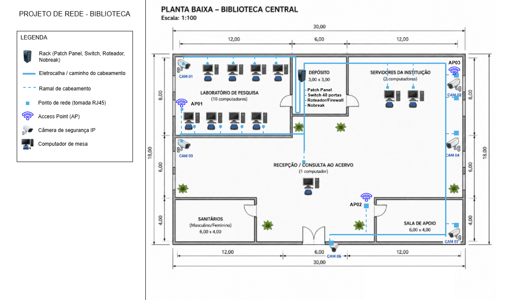

# Proposta de Infraestrutura de Rede para uma Biblioteca

Projeto acadêmico desenvolvido na disciplina de Redes de Computadores do
Curso Técnico em Informática Integrado ao Ensino Médio do IFRS – Campus Rolante.

## Sobre o projeto

O trabalho apresenta uma proposta de infraestrutura física e lógica de rede
para uma biblioteca, desenvolvida a partir de um cenário fornecido em aula.

A proposta contempla:

- cabeamento estruturado CAT6;
- rack e equipamentos de rede;
- switch gerenciável PoE;
- roteador/firewall;
- access points;
- câmeras IP;
- planejamento de pontos de rede;
- endereçamento IPv4 e divisão em sub-redes;
- DHCP e DNS;
- diagramas físico e lógico da infraestrutura.

> **Importante:** este é um projeto exclusivamente acadêmico. A infraestrutura
> apresentada foi planejada para fins de estudo e não foi implementada ou
> testada em um ambiente real.

## Diagramas

### Diagrama lógico

### Diagrama físico

## Artigo

O projeto completo foi documentado em formato de artigo utilizando o
template da Sociedade Brasileira de Computação (SBC).

O PDF final está disponível na pasta `artigo/`.

## Autores

- Gabrieli O. Pinto
- Henrique L. Guedes
- Isabela F. Silva
- Vinícius M. Aguiar

## Instituição

Instituto Federal do Rio Grande do Sul (IFRS) – Campus Rolante  
Curso Técnico em Informática Integrado ao Ensino Médio
